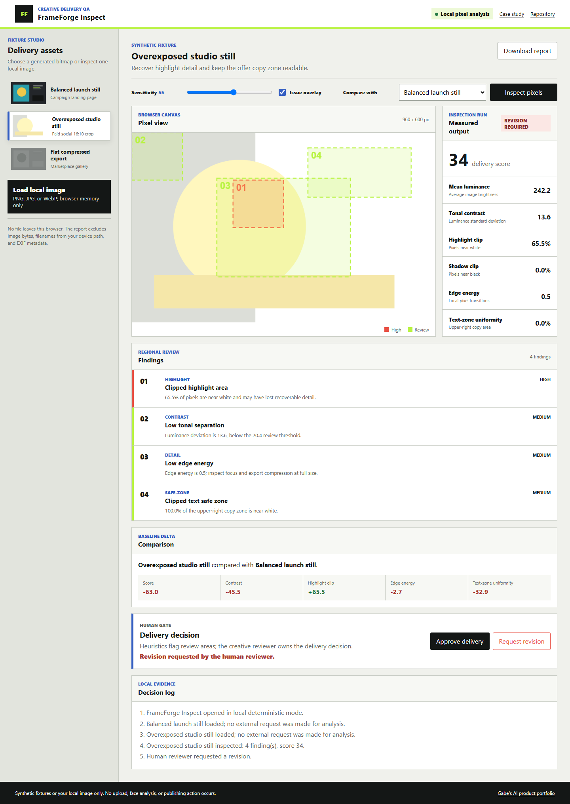
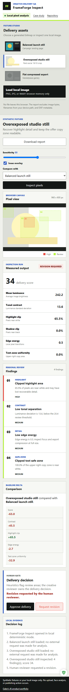

# FrameForge Inspect

FrameForge Inspect is a local-first browser workspace for creative delivery QA. It analyzes actual image pixels through Canvas, highlights regional concerns, compares measurable changes, and keeps the delivery decision with a human reviewer.

[Live demo](https://jubjub-cpu.github.io/frameforge-inspect/) | [Portfolio](https://jubjub-cpu.github.io/gabe-ai-product-portfolio/) | [v1.0.0 release](https://github.com/jubjub-cpu/frameforge-inspect/releases/tag/v1.0.0)

## Business Problem

Creative teams often discover overexposure, crushed shadows, low tonal separation, soft exports, or unsafe copy zones late in a delivery cycle. The original embedded FrameForge concept generated QA language from preset metadata. This rebuild inspects browser-decoded pixels and shows exactly which deterministic thresholds produced each finding.

## Target User

Content QA leads, creators, and small production teams reviewing campaign stills before delivery.

## Primary Workflow

1. Choose one of three generated bitmap fixtures or load a local PNG, JPG, or WebP.
2. Set inspection sensitivity and run pixel analysis.
3. Review luminance, contrast, clipping, edge energy, color balance, and text-zone uniformity.
4. Toggle regional issue overlays and compare against a different fixture baseline.
5. Approve the delivery or request revision at an explicit human gate.
6. Download a JSON record that excludes image bytes and EXIF data.

## What Is Real

- Canvas decodes and samples the selected bitmap in the browser.
- Metrics and regional overlays are calculated from the pixel buffer.
- Local file loading uses an in-memory object URL and no upload endpoint.
- Browser tests exercise fixture selection, analysis, overlay control, comparison, local upload, decision, export, and recovery states.

## AI Boundary

The v1.0.0 demo is a deterministic, AI-assisted product prototype. Its transparent heuristics stand in for an explainable computer-vision preprocessing layer; no hosted model is running. It does not identify people, classify sensitive attributes, judge artistic merit, transmit files, publish media, or make a delivery decision.

## Architecture

- `assets/analysis.mjs`: pure pixel metrics, findings, comparison, and export boundaries.
- `assets/app.js`: Canvas lifecycle, local file handling, rendering, overlay, and human decisions.
- `assets/fixtures/`: generated PNG evidence fixtures.
- `data/fixtures.json`: fictional delivery requirements and fixture metadata.
- `tests/analysis.test.mjs`: deterministic metric and threshold checks.
- `tests/browser-smoke.mjs`: desktop, mobile, keyboard, error, upload, export, and deployed workflow coverage.

See [docs/ARCHITECTURE.md](docs/ARCHITECTURE.md) and [docs/CASE_STUDY.md](docs/CASE_STUDY.md).

## Run Locally

Opening through a local server is required because the fixture manifest is fetched as JSON.

```powershell
powershell -ExecutionPolicy Bypass -File .\tools\static-server.ps1 -NodePath "C:\path\to\node.exe"
```

Then open `http://127.0.0.1:4179/`.

## Validation

```powershell
powershell -ExecutionPolicy Bypass -File .\tests\validate.ps1 -NodePath "C:\path\to\node.exe"
node .\tests\browser-smoke.mjs
```

Exact release evidence is recorded in [docs/VALIDATION.md](docs/VALIDATION.md).

## Accessibility, Privacy, and Security

- Skip navigation, semantic headings, native controls, visible focus, reduced motion, and responsive layouts.
- Synthetic generated fixtures only; local images remain in browser memory.
- No image bytes, EXIF data, personal email, token, customer data, analytics, cookies, backend, or third-party request.
- Export contains metrics, findings, selected fixture label, human decision, and event text only.

## Screenshots





## Limitations

- Heuristics are intentionally narrow and are not a substitute for calibrated color, focus, accessibility, legal, or brand review.
- Browser Canvas color management and image decoding can differ by platform.
- v1.0.0 supports still images only and does not persist reports.

## AI-Assisted Development

Product direction, workflow design, threshold design, test scenarios, visual review, and release decisions were directed by Gabe with AI-assisted implementation support. No customer use, production outcome, or traditional engineering employment is claimed.
